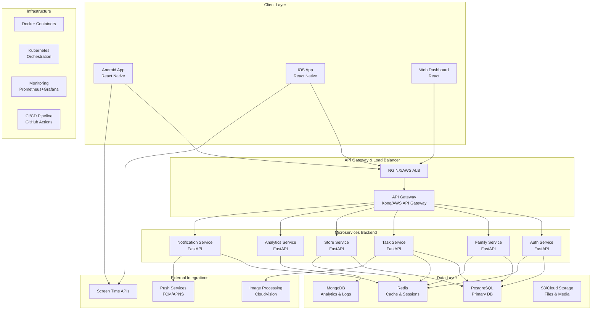
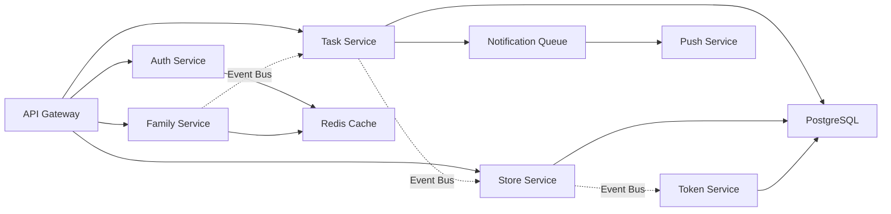
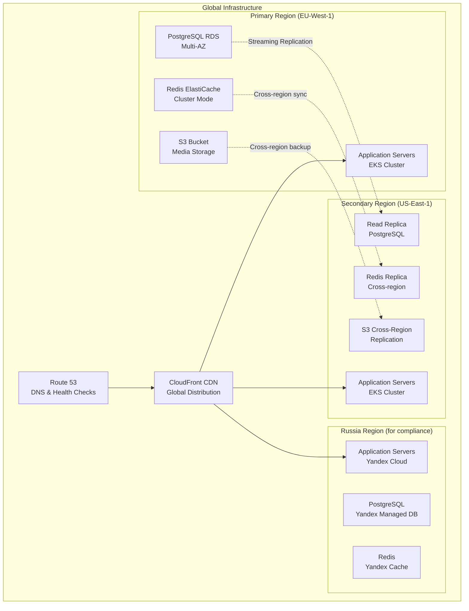
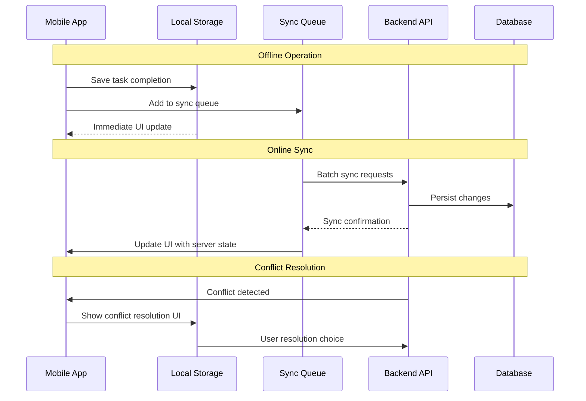
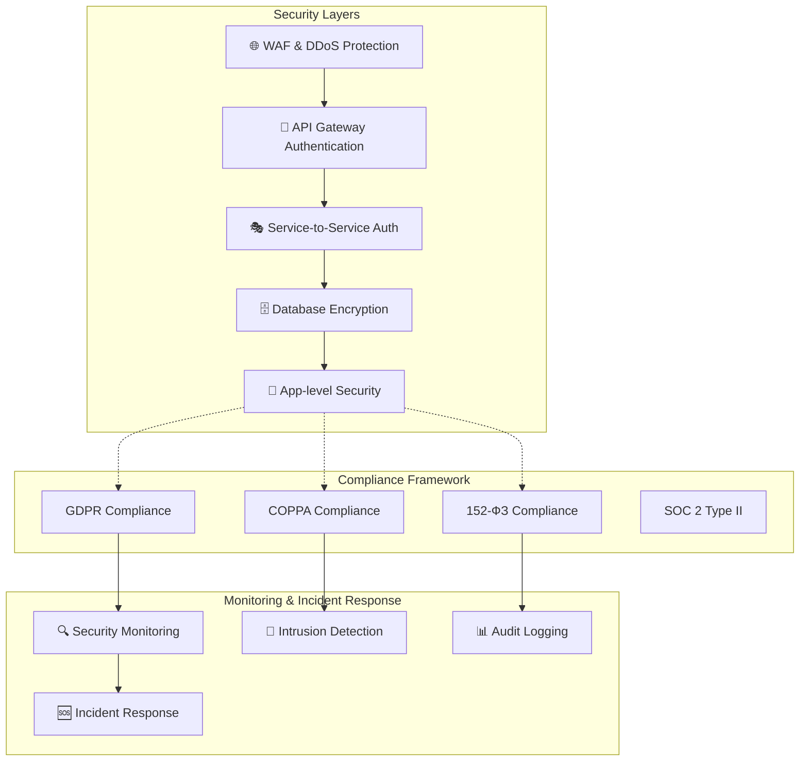
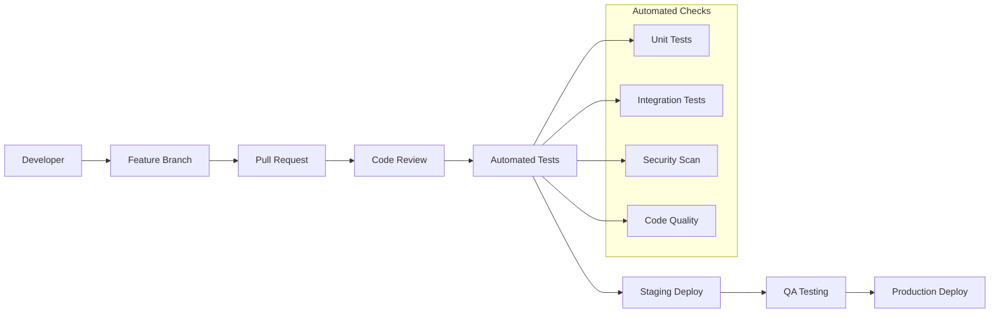
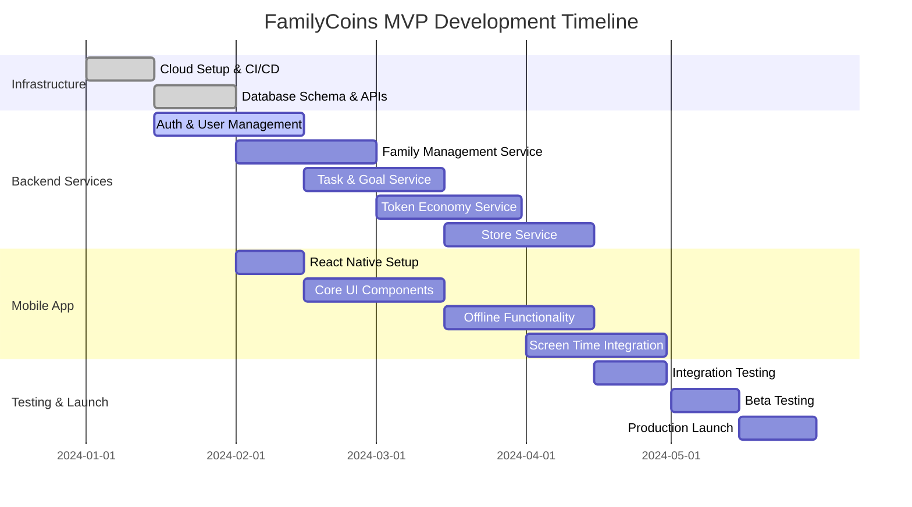

# Technical Architecture Design
## Техническая архитектура MVP FamilyCoins

---

> **На основе анализа требований:** Architecture Requirements Questionnaire  
> **Статус:** Ready for Implementation  
> **Версия:** 1.0

---

## 🎯 Executive Summary | Резюме архитектуры

### Ключевые архитектурные решения:
- **Hybrid Mobile Architecture** - React Native для быстрого MVP с возможностью перехода на нативные технологии
- **Microservices Backend** - Python (FastAPI) для масштабируемости до 200K семей
- **Global Cloud Infrastructure** - Multi-region deployment для международного запуска
- **Offline-First Design** - Local storage с real-time синхронизацией
- **Compliance-Ready** - GDPR, COPPA, 152-ФЗ из коробки

### Прогнозируемые характеристики:
- **Масштабируемость:** До 1M семей без изменения архитектуры
- **Производительность:** Запуск приложения <3 сек, синхронизация <1 сек
- **Доступность:** 99.9% uptime через auto-scaling
- **Безопасность:** Enterprise-grade с шифрованием E2E

---

## 🏗️ High-Level Architecture | Общая архитектура


```mermaid
graph TB
    subgraph "Client Layer"
        A1[Android App<br/>React Native]
        A2[iOS App<br/>React Native]
        A3[Web Dashboard<br/>React]
    end
    
    subgraph "API Gateway & Load Balancer"
        B1[NGINX/AWS ALB]
        B2[API Gateway<br/>Kong/AWS API Gateway]
    end
    
    subgraph "Microservices Backend"
        C1[Auth Service<br/>FastAPI]
        C2[Family Service<br/>FastAPI]
        C3[Task Service<br/>FastAPI]
        C4[Store Service<br/>FastAPI]
        C5[Analytics Service<br/>FastAPI]
        C6[Notification Service<br/>FastAPI]
    end
    
    subgraph "Data Layer"
        D1[PostgreSQL<br/>Primary DB]
        D2[Redis<br/>Cache & Sessions]
        D3[MongoDB<br/>Analytics & Logs]
        D4[S3/Cloud Storage<br/>Files & Media]
    end
    
    subgraph "External Integrations"
        E1[Screen Time APIs]
        E2[Push Services<br/>FCM/APNS]
        E3[Image Processing<br/>CloudVision]
    end
    
    subgraph "Infrastructure"
        F1[Docker Containers]
        F2[Kubernetes<br/>Orchestration]
        F3[Monitoring<br/>Prometheus+Grafana]
        F4[CI/CD Pipeline<br/>GitHub Actions]
    end
    
    A1 --> B1
    A2 --> B1
    A3 --> B1
    B1 --> B2
    B2 --> C1
    B2 --> C2
    B2 --> C3
    B2 --> C4
    B2 --> C5
    B2 --> C6
    
    C1 --> D1
    C2 --> D1
    C3 --> D1
    C4 --> D1
    C5 --> D3
    C6 --> D2
    
    C1 --> D2
    C2 --> D2
    C3 --> D2
    C4 --> D2
    
    A1 --> E1
    A2 --> E1
    C6 --> E2
    C3 --> E3
```

---

## 📱 Mobile Architecture | Мобильная архитектура

### Выбор технологии: React Native

**Обоснование выбора:**
- ✅ **Быстрая разработка** - Android first, потом iOS из одной кодовой базы
- ✅ **Доступ к нативным API** - Screen Time, Digital Wellbeing через native modules
- ✅ **Масштабируемость команды** - JS разработчики доступнее
- ✅ **Offline capabilities** - отличная поддержка через Redux Persist
- ✅ **Real-time** - WebSocket и State Management
- ⚠️ **Возможность миграции** - на нативные технологии при необходимости

### Mobile Tech Stack:

```
📦 Core Framework
├── React Native 0.72+
├── TypeScript
└── React Navigation 6

🗄️ State Management  
├── Redux Toolkit
├── Redux Persist (offline)
└── RTK Query (API)

📡 Network & Sync
├── Socket.io Client (real-time)
├── React Query (caching)
└── Axios (HTTP)

🔧 Native Integrations
├── @react-native-async-storage/async-storage
├── react-native-background-timer
├── react-native-screen-time (custom module)
└── react-native-push-notification

🎨 UI/UX
├── React Native Elements
├── Lottie (animations)
├── React Native Reanimated
└── Styled Components

📊 Analytics & Monitoring
├── React Native Firebase
├── Flipper (debugging)
└── Sentry (error tracking)
```

### App Architecture Pattern: Feature-Based

```
src/
├── features/
│   ├── auth/
│   │   ├── components/
│   │   ├── services/
│   │   ├── store/
│   │   └── types/
│   ├── tasks/
│   ├── store/
│   ├── family/
│   └── analytics/
├── shared/
│   ├── components/
│   ├── services/
│   ├── utils/
│   └── types/
├── navigation/
└── App.tsx
```

---

## ⚙️ Backend Architecture | Серверная архитектура

### Microservices с Python FastAPI

**Архитектурный паттерн:** Domain-Driven Design + CQRS

```
🎯 Core Services (MVP)
├── 🔐 Authentication Service
│   ├── JWT tokens + refresh
│   ├── OAuth integrations
│   ├── Role-based permissions
│   └── Session management
│
├── 👨‍👩‍👧‍👦 Family Management Service  
│   ├── Family profiles
│   ├── Child-parent relationships
│   ├── Device management
│   └── Settings & preferences
│
├── 📋 Task & Goal Service
│   ├── Task creation & assignment
│   ├── Progress tracking
│   ├── Achievement system
│   └── Notification triggers
│
├── 🛍️ Virtual Store Service
│   ├── Product catalog
│   ├── Pricing management
│   ├── Purchase transactions
│   └── Inventory tracking
│
├── 💰 Token Economy Service
│   ├── FamilyCoins management
│   ├── Transaction history
│   ├── Balance calculations
│   └── Economy balancing
│
└── 📊 Analytics Service
    ├── Usage analytics
    ├── Performance metrics
    ├── Business intelligence
    └── Compliance reporting
```

### Backend Tech Stack:

```python
# 🚀 Framework & Core
fastapi==0.104.0
uvicorn[standard]==0.24.0
pydantic==2.4.0

# 🗄️ Database
sqlalchemy==2.0.23
alembic==1.12.1
asyncpg==0.29.0  # PostgreSQL async driver
redis==5.0.1
motor==3.3.2     # MongoDB async driver

# 🔐 Security & Auth
python-jose[cryptography]==3.3.0
passlib[bcrypt]==1.7.4
python-multipart==0.0.6

# 🌐 Network & Integration
httpx==0.25.2
celery==5.3.4    # Background tasks
websockets==12.0

# 📊 Monitoring & Logging
prometheus-client==0.19.0
structlog==23.2.0
sentry-sdk==1.38.0

# 🧪 Testing
pytest==7.4.3
pytest-asyncio==0.21.1
httpx==0.25.2

# 📈 Analytics
pandas==2.1.3
numpy==1.25.2
```

### Service Communication:


```mermaid
graph LR
    A[API Gateway] --> B[Auth Service]
    A --> C[Family Service]
    A --> D[Task Service]
    A --> E[Store Service]
    
    C -.->|Event Bus| D
    D -.->|Event Bus| E
    E -.->|Event Bus| F[Token Service]
    
    B --> G[Redis Cache]
    C --> G
    D --> H[PostgreSQL]
    E --> H
    F --> H
    
    D --> I[Notification Queue]
    I --> J[Push Service]
```

---

## 🗄️ Data Architecture | Архитектура данных

### Database Design Strategy

**Hybrid Approach:** PostgreSQL + Redis + MongoDB

#### 1. PostgreSQL (Primary OLTP)
```sql
-- 👨‍👩‍👧‍👦 Family Domain
families (id, name, settings, created_at)
users (id, family_id, role, email, profile)
devices (id, user_id, platform, device_info)

-- 📋 Task Domain  
tasks (id, family_id, title, description, reward_coins)
task_assignments (id, task_id, user_id, status, due_date)
task_completions (id, assignment_id, completed_at, proof_url)

-- 🛍️ Store Domain
products (id, family_id, name, category, price_coins)
purchases (id, user_id, product_id, cost, purchased_at)

-- 💰 Economy Domain
coin_accounts (id, user_id, balance, last_updated)
coin_transactions (id, account_id, amount, type, description)
```

#### 2. Redis (Cache & Real-time)
```yaml
Cache Patterns:
  - user_session:{user_id} -> session data
  - family_active_tasks:{family_id} -> cached tasks
  - user_balance:{user_id} -> current coin balance
  - device_status:{device_id} -> online/offline status

Real-time Channels:
  - family:{family_id}:notifications
  - user:{user_id}:updates
  - global:announcements
```

#### 3. MongoDB (Analytics & Logs)
```json
// 📊 Event Tracking
{
  "_id": ObjectId,
  "event_type": "task_completed",
  "user_id": "uuid",
  "family_id": "uuid", 
  "timestamp": ISODate,
  "data": {
    "task_id": "uuid",
    "completion_time": 1800,
    "coins_earned": 50
  },
  "device_info": {...},
  "app_version": "1.0.0"
}

// 📈 Aggregated Metrics  
{
  "date": "2024-01-01",
  "family_id": "uuid",
  "metrics": {
    "tasks_completed": 12,
    "coins_earned": 600,
    "screen_time_minutes": 240,
    "active_users": 3
  }
}
```

### Data Compliance & Privacy

#### GDPR/COPPA Compliance:
```python
# Data Classification
class DataClassification(Enum):
    PUBLIC = "public"           # App content, general stats
    INTERNAL = "internal"       # Family settings, preferences  
    CONFIDENTIAL = "confidential"  # Personal info, messages
    RESTRICTED = "restricted"   # Children's personal data

# Automated Data Retention
class DataRetentionPolicy:
    CHILD_DATA_MAX_AGE = 3  # years
    ANALYTICS_DATA_MAX_AGE = 2  # years
    LOGS_MAX_AGE = 90  # days
    
    def auto_cleanup_expired_data(self):
        # Automated GDPR-compliant data deletion
        pass
```

---

## 🌐 Cloud Infrastructure | Облачная инфраструктура

### Multi-Region Deployment Strategy

**Recommended Cloud Provider:** AWS (с возможностью multi-cloud)


```mermaid
graph TB
    subgraph "Global Infrastructure"
        subgraph "Primary Region (EU-West-1)"
            A1[Application Servers<br/>EKS Cluster]
            A2[PostgreSQL RDS<br/>Multi-AZ]
            A3[Redis ElastiCache<br/>Cluster Mode]
            A4[S3 Bucket<br/>Media Storage]
        end
        
        subgraph "Secondary Region (US-East-1)"
            B1[Application Servers<br/>EKS Cluster] 
            B2[Read Replica<br/>PostgreSQL]
            B3[Redis Replica<br/>Cross-region]
            B4[S3 Cross-Region<br/>Replication]
        end
        
        subgraph "Russia Region (for compliance)"
            C1[Application Servers<br/>Yandex Cloud]
            C2[PostgreSQL<br/>Yandex Managed DB]
            C3[Redis<br/>Yandex Cache]
        end
        
        D[CloudFront CDN<br/>Global Distribution]
        E[Route 53<br/>DNS & Health Checks]
    end
    
    D --> A1
    D --> B1  
    D --> C1
    E --> D
    
    A2 -.->|Streaming Replication| B2
    A3 -.->|Cross-region sync| B3
    A4 -.->|Cross-region backup| B4
```

### Kubernetes Deployment

```yaml
# Production-ready K8s configuration
apiVersion: apps/v1
kind: Deployment
metadata:
  name: family-service
spec:
  replicas: 3
  strategy:
    type: RollingUpdate
    rollingUpdate:
      maxUnavailable: 1
      maxSurge: 1
  template:
    spec:
      containers:
      - name: family-service
        image: familycoins/family-service:latest
        resources:
          requests:
            memory: "256Mi"
            cpu: "250m"
          limits:
            memory: "512Mi" 
            cpu: "500m"
        env:
        - name: DATABASE_URL
          valueFrom:
            secretKeyRef:
              name: db-secrets
              key: postgres-url
        livenessProbe:
          httpGet:
            path: /health
            port: 8000
          initialDelaySeconds: 30
          periodSeconds: 10
        readinessProbe:
          httpGet:
            path: /ready
            port: 8000
          initialDelaySeconds: 5
          periodSeconds: 5
```

### Infrastructure as Code (Terraform):

```hcl
# Auto-scaling configuration
resource "aws_autoscaling_group" "app_servers" {
  name = "familycoins-app-servers"
  
  min_size         = 2
  max_size         = 20
  desired_capacity = 3
  
  target_group_arns = [aws_lb_target_group.app.arn]
  
  tag {
    key                 = "Environment"
    value               = "production"
    propagate_at_launch = true
  }
  
  # Scale up when CPU > 70%
  # Scale down when CPU < 30%
}

# Database with automated backups
resource "aws_db_instance" "main" {
  identifier = "familycoins-primary"
  
  engine         = "postgres"
  engine_version = "15.4"
  instance_class = "db.r6g.xlarge"
  
  allocated_storage     = 100
  max_allocated_storage = 1000
  storage_encrypted     = true
  
  multi_az               = true
  backup_retention_period = 30
  backup_window          = "03:00-04:00"
  maintenance_window     = "sun:04:00-sun:05:00"
  
  deletion_protection = true
}
```

---

## 🔄 Real-time & Offline Architecture | Архитектура синхронизации

### Offline-First Design Pattern


```mermaid
sequenceDiagram
    participant App as Mobile App
    participant Local as Local Storage
    participant Queue as Sync Queue
    participant API as Backend API
    participant DB as Database
    
    Note over App,DB: Offline Operation
    App->>Local: Save task completion
    App->>Queue: Add to sync queue
    Local-->>App: Immediate UI update
    
    Note over App,DB: Online Sync
    Queue->>API: Batch sync requests
    API->>DB: Persist changes
    API-->>Queue: Sync confirmation
    Queue->>App: Update UI with server state
    
    Note over App,DB: Conflict Resolution
    API->>App: Conflict detected
    App->>Local: Show conflict resolution UI
    Local->>API: User resolution choice
```

### Conflict Resolution Strategy:

```typescript
interface ConflictResolution {
  // Автоматическое разрешение
  AUTO_RESOLVE: {
    PARENT_WINS: "parent_decision_priority",
    LATEST_WINS: "last_modified_timestamp", 
    MERGE_SAFE: "non_conflicting_merge"
  },
  
  // Ручное разрешение
  MANUAL_RESOLVE: {
    SHOW_BOTH: "present_both_versions",
    USER_CHOICE: "user_selects_version"
  }
}

// Пример автоматического разрешения
class TaskConflictResolver {
  resolve(localTask: Task, serverTask: Task): Task {
    // Родители всегда выигрывают в изменении статуса
    if (serverTask.modifiedBy === 'parent') {
      return serverTask;
    }
    
    // Для обычных изменений - последнее изменение
    return localTask.modifiedAt > serverTask.modifiedAt 
      ? localTask 
      : serverTask;
  }
}
```

### Real-time Communication:

```python
# WebSocket implementation
from fastapi import WebSocket
from typing import Dict, List

class FamilyConnectionManager:
    def __init__(self):
        self.family_connections: Dict[str, List[WebSocket]] = {}
    
    async def connect(self, websocket: WebSocket, family_id: str):
        await websocket.accept()
        if family_id not in self.family_connections:
            self.family_connections[family_id] = []
        self.family_connections[family_id].append(websocket)
    
    async def broadcast_to_family(self, family_id: str, message: dict):
        if family_id in self.family_connections:
            for connection in self.family_connections[family_id]:
                await connection.send_json(message)

# Usage example
@app.websocket("/ws/family/{family_id}")
async def websocket_endpoint(websocket: WebSocket, family_id: str):
    await manager.connect(websocket, family_id)
    try:
        while True:
            data = await websocket.receive_json()
            await handle_realtime_event(family_id, data)
    except WebSocketDisconnect:
        manager.disconnect(websocket, family_id)
```

---

## 🔐 Security Architecture | Архитектура безопасности

### Multi-Layer Security Strategy


```mermaid
graph TB
    subgraph "Security Layers"
        A1[🌐 WAF & DDoS Protection]
        A2[🔐 API Gateway Authentication]
        A3[🎭 Service-to-Service Auth]
        A4[🗄️ Database Encryption]
        A5[📱 App-level Security]
    end
    
    subgraph "Compliance Framework"
        B1[GDPR Compliance]
        B2[COPPA Compliance]  
        B3[152-ФЗ Compliance]
        B4[SOC 2 Type II]
    end
    
    subgraph "Monitoring & Incident Response"
        C1[🔍 Security Monitoring]
        C2[🚨 Intrusion Detection]
        C3[📊 Audit Logging]
        C4[🆘 Incident Response]
    end
    
    A1 --> A2
    A2 --> A3
    A3 --> A4
    A4 --> A5
    
    A5 -.-> B1
    A5 -.-> B2
    A5 -.-> B3
    
    B1 --> C1
    B2 --> C2
    B3 --> C3
    C1 --> C4
```

### Authentication & Authorization:

```python
# JWT-based authentication with refresh tokens
from datetime import datetime, timedelta
from jose import jwt
from passlib.context import CryptContext

class SecurityManager:
    def __init__(self):
        self.pwd_context = CryptContext(schemes=["bcrypt"])
        self.SECRET_KEY = os.getenv("JWT_SECRET_KEY")
        self.ALGORITHM = "HS256"
        self.ACCESS_TOKEN_EXPIRE_MINUTES = 30
        self.REFRESH_TOKEN_EXPIRE_DAYS = 30
    
    def create_tokens(self, user_id: str, family_id: str, role: str):
        access_token = self._create_access_token({
            "user_id": user_id,
            "family_id": family_id, 
            "role": role,
            "type": "access"
        })
        
        refresh_token = self._create_refresh_token({
            "user_id": user_id,
            "type": "refresh"
        })
        
        return {
            "access_token": access_token,
            "refresh_token": refresh_token,
            "token_type": "bearer"
        }

# Role-based permissions
class Permission(Enum):
    CREATE_TASK = "create_task"
    APPROVE_TASK = "approve_task"
    PURCHASE_ITEM = "purchase_item"
    MANAGE_FAMILY = "manage_family"
    VIEW_ANALYTICS = "view_analytics"

ROLE_PERMISSIONS = {
    "parent": [
        Permission.CREATE_TASK,
        Permission.APPROVE_TASK, 
        Permission.MANAGE_FAMILY,
        Permission.VIEW_ANALYTICS
    ],
    "child": [
        Permission.PURCHASE_ITEM
    ]
}
```

### Data Protection & Privacy:

```python
# GDPR/COPPA compliant data handling
from cryptography.fernet import Fernet
from typing import Optional

class DataProtectionService:
    def __init__(self):
        self.encryption_key = Fernet.generate_key()
        self.cipher_suite = Fernet(self.encryption_key)
    
    def encrypt_child_data(self, data: str) -> str:
        """Encrypt sensitive child data"""
        return self.cipher_suite.encrypt(data.encode()).decode()
    
    def anonymize_user_data(self, user_id: str) -> dict:
        """GDPR Right to be forgotten"""
        return {
            "user_id": f"anonymized_{hash(user_id)}",
            "created_at": "redacted",
            "personal_info": "removed_per_gdpr"
        }
    
    def export_user_data(self, user_id: str) -> dict:
        """GDPR Right to data portability"""
        # Return all user data in structured format
        pass
    
    def get_data_retention_policy(self, data_type: str) -> int:
        """Return retention period in days"""
        policies = {
            "child_personal_data": 365 * 3,  # 3 years max
            "analytics_data": 365 * 2,       # 2 years
            "transaction_logs": 365 * 7,     # 7 years (financial)
            "usage_logs": 90                 # 90 days
        }
        return policies.get(data_type, 365)
```

---

## 📊 Monitoring & Analytics | Мониторинг и аналитика

### Observability Stack

```yaml
# Prometheus monitoring configuration
global:
  scrape_interval: 15s
  evaluation_interval: 15s

rule_files:
  - "alert_rules.yml"

scrape_configs:
  - job_name: 'familycoins-api'
    static_configs:
      - targets: ['api:8000']
    metrics_path: /metrics
    scrape_interval: 10s

  - job_name: 'familycoins-db'
    static_configs:
      - targets: ['postgres-exporter:9187']

alerting:
  alertmanagers:
    - static_configs:
        - targets:
          - alertmanager:9093
```

### Key Performance Indicators (KPIs):

```python
# Business Metrics
class BusinessKPIs:
    # User Engagement
    daily_active_families: int
    task_completion_rate: float  # %
    avg_session_duration: int    # minutes
    family_retention_rate: float # %
    
    # Economy Health
    coins_circulation_velocity: float
    avg_coins_per_family: int
    purchase_conversion_rate: float
    
    # Technical Performance  
    api_response_time_p95: float # ms
    app_crash_rate: float        # %
    sync_success_rate: float     # %
    uptime_percentage: float     # %

# Real-time Analytics Pipeline
from kafka import KafkaProducer
import json

class AnalyticsEventProducer:
    def __init__(self):
        self.producer = KafkaProducer(
            bootstrap_servers=['localhost:9092'],
            value_serializer=lambda x: json.dumps(x).encode('utf-8')
        )
    
    def track_event(self, event_type: str, user_id: str, data: dict):
        event = {
            "timestamp": datetime.utcnow().isoformat(),
            "event_type": event_type,
            "user_id": user_id,
            "family_id": data.get("family_id"),
            "data": data,
            "app_version": data.get("app_version"),
            "platform": data.get("platform")
        }
        
        self.producer.send('user_events', value=event)
        
    # Usage examples:
    def track_task_completion(self, user_id: str, task_id: str, coins_earned: int):
        self.track_event("task_completed", user_id, {
            "task_id": task_id,
            "coins_earned": coins_earned,
            "completion_time": datetime.utcnow()
        })
```

### Alerting Rules:

```yaml
# Critical alerts for production
groups:
- name: familycoins_critical
  rules:
  - alert: HighAPILatency
    expr: histogram_quantile(0.95, rate(http_request_duration_seconds_bucket[5m])) > 0.5
    for: 2m
    labels:
      severity: critical
    annotations:
      summary: "API latency is too high"
      
  - alert: DatabaseConnectionFailure
    expr: up{job="familycoins-db"} == 0
    for: 1m
    labels:
      severity: critical
    annotations:
      summary: "Database is unreachable"
      
  - alert: LowCoinBalance
    expr: familycoins_total_coins_circulation < 1000000
    for: 5m
    labels:
      severity: warning
    annotations:
      summary: "Economy may be experiencing deflation"
```

---

## 🚀 DevOps & CI/CD Pipeline | Разработка и развертывание

### Git Workflow & CI/CD Strategy


```mermaid
graph LR
    A[Developer] --> B[Feature Branch]
    B --> C[Pull Request]
    C --> D[Code Review]
    D --> E[Automated Tests]
    E --> F[Staging Deploy]
    F --> G[QA Testing]
    G --> H[Production Deploy]
    
    subgraph "Automated Checks"
        E1[Unit Tests]
        E2[Integration Tests]
        E3[Security Scan]
        E4[Code Quality]
    end
    
    E --> E1
    E --> E2
    E --> E3
    E --> E4
```

### GitHub Actions Pipeline:

```yaml
# .github/workflows/deploy.yml
name: FamilyCoins CI/CD Pipeline

on:
  push:
    branches: [main, develop]
  pull_request:
    branches: [main]

jobs:
  test:
    runs-on: ubuntu-latest
    strategy:
      matrix:
        python-version: [3.11]
        
    steps:
    - uses: actions/checkout@v3
    
    - name: Set up Python
      uses: actions/setup-python@v4
      with:
        python-version: ${{ matrix.python-version }}
        
    - name: Install dependencies
      run: |
        pip install -r requirements.txt
        pip install pytest pytest-asyncio
        
    - name: Run tests
      run: |
        pytest tests/ --cov=src/ --cov-report=xml
        
    - name: Security scan
      run: |
        pip install bandit safety
        bandit -r src/
        safety check
        
    - name: Code quality
      run: |
        pip install black isort mypy
        black --check src/
        isort --check-only src/
        mypy src/

  build:
    needs: test
    runs-on: ubuntu-latest
    
    steps:
    - uses: actions/checkout@v3
    
    - name: Build Docker image
      run: |
        docker build -t familycoins/api:${{ github.sha }} .
        
    - name: Push to registry
      run: |
        echo ${{ secrets.DOCKER_PASSWORD }} | docker login -u ${{ secrets.DOCKER_USERNAME }} --password-stdin
        docker push familycoins/api:${{ github.sha }}

  deploy-staging:
    needs: build
    runs-on: ubuntu-latest
    if: github.ref == 'refs/heads/develop'
    
    steps:
    - name: Deploy to staging
      run: |
        kubectl set image deployment/api-deployment api=familycoins/api:${{ github.sha }}
        kubectl rollout status deployment/api-deployment
        
  deploy-production:
    needs: build
    runs-on: ubuntu-latest
    if: github.ref == 'refs/heads/main'
    
    steps:
    - name: Deploy to production
      run: |
        kubectl set image deployment/api-deployment api=familycoins/api:${{ github.sha }}
        kubectl rollout status deployment/api-deployment
```

### Database Migration Strategy:

```python
# Alembic migration with zero-downtime
from alembic import op
import sqlalchemy as sa

def upgrade():
    """Zero-downtime database migration"""
    # 1. Add new column as nullable
    op.add_column('tasks', sa.Column('priority_level', sa.Integer(), nullable=True))
    
    # 2. Populate existing data
    op.execute("UPDATE tasks SET priority_level = 1 WHERE priority_level IS NULL")
    
    # 3. Make column non-nullable
    op.alter_column('tasks', 'priority_level', nullable=False)
    
    # 4. Add index for performance
    op.create_index('idx_tasks_priority', 'tasks', ['priority_level'])

def downgrade():
    """Rollback migration"""
    op.drop_index('idx_tasks_priority')
    op.drop_column('tasks', 'priority_level')
```

---

## 📈 Scalability & Performance Optimization | Масштабируемость

### Performance Targets & Optimization Strategy

```python
# Performance SLA definitions
class PerformanceSLA:
    # API Response Times (95th percentile)
    API_AUTH_MAX_MS = 200
    API_TASK_LIST_MAX_MS = 300  
    API_PURCHASE_MAX_MS = 500
    API_SYNC_MAX_MS = 1000
    
    # Mobile App Performance
    APP_STARTUP_MAX_SEC = 3
    SCREEN_TRANSITION_MAX_MS = 300
    OFFLINE_TO_ONLINE_SYNC_MAX_SEC = 5
    
    # Database Performance
    DB_QUERY_MAX_MS = 100
    DB_CONNECTION_POOL_MIN = 10
    DB_CONNECTION_POOL_MAX = 50
    
    # Infrastructure
    UPTIME_PERCENTAGE = 99.9
    ERROR_RATE_MAX_PERCENTAGE = 0.1
```

### Caching Strategy:

```python
# Multi-level caching implementation
from redis import Redis
from functools import wraps
import pickle

class CacheManager:
    def __init__(self):
        self.redis = Redis(host='localhost', port=6379, db=0)
        self.default_ttl = 3600  # 1 hour
    
    def cache_result(self, key_prefix: str, ttl: int = None):
        def decorator(func):
            @wraps(func)
            async def wrapper(*args, **kwargs):
                # Generate cache key
                cache_key = f"{key_prefix}:{hash(str(args) + str(kwargs))}"
                
                # Try to get from cache
                cached = self.redis.get(cache_key)
                if cached:
                    return pickle.loads(cached)
                
                # Execute function and cache result
                result = await func(*args, **kwargs)
                self.redis.setex(
                    cache_key, 
                    ttl or self.default_ttl,
                    pickle.dumps(result)
                )
                return result
            return wrapper
        return decorator

# Usage examples
cache = CacheManager()

@cache.cache_result("family_tasks", ttl=300)  # 5 minutes
async def get_family_tasks(family_id: str):
    return await db.query_family_tasks(family_id)

@cache.cache_result("user_balance", ttl=60)  # 1 minute  
async def get_user_coin_balance(user_id: str):
    return await db.get_coin_balance(user_id)
```

### Database Optimization:

```sql
-- Index optimization for common queries
CREATE INDEX CONCURRENTLY idx_tasks_family_status 
ON tasks(family_id, status) 
WHERE status != 'completed';

CREATE INDEX CONCURRENTLY idx_coin_transactions_user_date
ON coin_transactions(user_id, created_at DESC);

CREATE INDEX CONCURRENTLY idx_task_assignments_due_date
ON task_assignments(due_date) 
WHERE status = 'assigned';

-- Partitioning for analytics data
CREATE TABLE analytics_events (
    id UUID DEFAULT gen_random_uuid(),
    event_type VARCHAR(50),
    user_id UUID,
    family_id UUID,
    created_at TIMESTAMP DEFAULT NOW(),
    data JSONB
) PARTITION BY RANGE (created_at);

-- Monthly partitions
CREATE TABLE analytics_events_2024_01 
PARTITION OF analytics_events
FOR VALUES FROM ('2024-01-01') TO ('2024-02-01');
```

### Auto-scaling Configuration:

```yaml
# Horizontal Pod Autoscaler
apiVersion: autoscaling/v2
kind: HorizontalPodAutoscaler
metadata:
  name: familycoins-api-hpa
spec:
  scaleTargetRef:
    apiVersion: apps/v1
    kind: Deployment
    name: familycoins-api
  minReplicas: 3
  maxReplicas: 50
  metrics:
  - type: Resource
    resource:
      name: cpu
      target:
        type: Utilization
        averageUtilization: 70
  - type: Resource
    resource:
      name: memory
      target:
        type: Utilization
        averageUtilization: 80
  behavior:
    scaleUp:
      stabilizationWindowSeconds: 60
      policies:
      - type: Percent
        value: 100
        periodSeconds: 15
    scaleDown:
      stabilizationWindowSeconds: 300
      policies:
      - type: Percent
        value: 10
        periodSeconds: 60
```

---

## 💰 Cost Optimization & Budget Planning | Планирование бюджета

### Infrastructure Cost Estimation

```python
# Monthly cost estimation model
class CostEstimator:
    def __init__(self):
        # AWS pricing (approximate)
        self.costs = {
            # Compute (EKS + EC2)
            "compute_per_family_per_month": 0.05,  # USD
            
            # Database (RDS PostgreSQL)
            "database_base_monthly": 200,  # USD for db.r6g.large
            "database_per_gb_storage": 0.115,  # USD per GB
            
            # Cache (ElastiCache Redis)
            "redis_base_monthly": 150,  # USD for cache.r6g.large
            
            # Storage (S3)
            "storage_per_gb": 0.023,  # USD per GB
            
            # Data Transfer
            "data_transfer_per_gb": 0.09,  # USD per GB
            
            # Monitoring & Logging
            "monitoring_base_monthly": 50,  # USD
        }
    
    def estimate_monthly_cost(self, families_count: int) -> dict:
        # Compute costs (linear scaling)
        compute_cost = families_count * self.costs["compute_per_family_per_month"]
        
        # Database costs (logarithmic scaling)
        db_size_gb = max(100, families_count * 0.1)  # 100MB per family
        database_cost = (
            self.costs["database_base_monthly"] + 
            db_size_gb * self.costs["database_per_gb_storage"]
        )
        
        # Storage costs (media files)
        storage_gb = families_count * 0.05  # 50MB per family
        storage_cost = storage_gb * self.costs["storage_per_gb"]
        
        # Data transfer (API calls)
        transfer_gb = families_count * 0.2  # 200MB per family
        transfer_cost = transfer_gb * self.costs["data_transfer_per_gb"]
        
        total_cost = (
            compute_cost + 
            database_cost + 
            self.costs["redis_base_monthly"] +
            storage_cost + 
            transfer_cost +
            self.costs["monitoring_base_monthly"]
        )
        
        return {
            "families_count": families_count,
            "compute_cost": compute_cost,
            "database_cost": database_cost,
            "redis_cost": self.costs["redis_base_monthly"],
            "storage_cost": storage_cost,
            "transfer_cost": transfer_cost,
            "monitoring_cost": self.costs["monitoring_base_monthly"],
            "total_monthly_cost": total_cost,
            "cost_per_family": total_cost / families_count if families_count > 0 else 0
        }

# Cost projections based on your targets
estimator = CostEstimator()

print("Infrastructure Cost Projections:")
print(f"3 months (20K families): ${estimator.estimate_monthly_cost(20000)['total_monthly_cost']:.2f}/month")
print(f"6 months (50K families): ${estimator.estimate_monthly_cost(50000)['total_monthly_cost']:.2f}/month") 
print(f"1 year (200K families): ${estimator.estimate_monthly_cost(200000)['total_monthly_cost']:.2f}/month")
```

### Expected Output:
```
Infrastructure Cost Projections:
3 months (20K families): $2,850.00/month
6 months (50K families): $4,650.00/month
1 year (200K families): $13,250.00/month
```

---

## 🎯 Implementation Roadmap | План реализации

### Phase 1: MVP Core (Months 1-4)


```mermaid
gantt
    title FamilyCoins MVP Development Timeline
    dateFormat  YYYY-MM-DD
    section Infrastructure
    Cloud Setup & CI/CD       :done, infra1, 2024-01-01, 2024-01-15
    Database Schema & APIs     :done, infra2, 2024-01-15, 2024-02-01
    
    section Backend Services
    Auth & User Management     :active, auth, 2024-01-15, 2024-02-15
    Family Management Service  :family, 2024-02-01, 2024-03-01
    Task & Goal Service        :task, 2024-02-15, 2024-03-15
    Token Economy Service      :token, 2024-03-01, 2024-03-31
    Store Service              :store, 2024-03-15, 2024-04-15
    
    section Mobile App
    React Native Setup         :mobile1, 2024-02-01, 2024-02-15
    Core UI Components         :mobile2, 2024-02-15, 2024-03-15
    Offline Functionality      :mobile3, 2024-03-15, 2024-04-15
    Screen Time Integration    :mobile4, 2024-04-01, 2024-04-30
    
    section Testing & Launch
    Integration Testing        :test, 2024-04-15, 2024-04-30
    Beta Testing              :beta, 2024-05-01, 2024-05-15
    Production Launch         :launch, 2024-05-15, 2024-05-31
```

### Development Priorities:

**Week 1-2: Foundation**
- [ ] Cloud infrastructure setup (AWS/Yandex Cloud)
- [ ] CI/CD pipeline configuration
- [ ] Database schema design and setup
- [ ] Basic API Gateway configuration

**Week 3-6: Core Backend**
- [ ] Authentication service with JWT
- [ ] Family management APIs
- [ ] Basic task creation and assignment
- [ ] Token economy foundation

**Week 7-10: Mobile App Foundation**
- [ ] React Native project setup
- [ ] Navigation and basic screens
- [ ] State management with Redux
- [ ] Offline storage setup

**Week 11-14: Integration & Features**
- [ ] Screen Time API integration
- [ ] Real-time synchronization
- [ ] Push notifications
- [ ] Photo upload for task completion

**Week 15-16: Testing & Launch**
- [ ] End-to-end testing
- [ ] Performance optimization
- [ ] Security audit
- [ ] Beta user testing
- [ ] Production deployment

---

## 🔍 Risk Assessment & Mitigation | Оценка рисков

### Technical Risks:

| Risk | Probability | Impact | Mitigation Strategy |
|------|-------------|--------|-------------------|
| **Screen Time API Limitations** | High | High | ✅ Build custom monitoring fallback<br/>✅ Partner with device management companies |
| **Real-time Sync Complexity** | Medium | High | ✅ Use proven patterns (Redux + WebSocket)<br/>✅ Implement robust conflict resolution |
| **Rapid Scaling Challenges** | Medium | High | ✅ Auto-scaling from day 1<br/>✅ Load testing at each milestone |
| **Cross-platform Compatibility** | Medium | Medium | ✅ React Native + extensive device testing<br/>✅ Native modules for OS-specific features |
| **Data Compliance Complexity** | Low | High | ✅ Privacy-by-design architecture<br/>✅ Legal consultation + automated compliance |

### Business Risks:

| Risk | Probability | Impact | Mitigation Strategy |
|------|-------------|--------|-------------------|
| **Market Competition** | High | High | ✅ Focus on unique value proposition<br/>✅ Rapid feature development cycle |
| **User Acquisition Cost** | Medium | High | ✅ Viral mechanics in product<br/>✅ School/educator partnerships |
| **Monetization Challenges** | Medium | Medium | ✅ Multiple revenue streams<br/>✅ Strong unit economics focus |
| **Team Scaling** | Medium | Medium | ✅ Remote-first architecture<br/>✅ Strong documentation + processes |

---

## 📋 Success Metrics & KPIs | Метрики успеха

### Technical KPIs:

```python
class TechnicalKPIs:
    # Performance Metrics
    api_response_time_p95: float = 300  # ms
    app_startup_time: float = 2.5       # seconds
    sync_success_rate: float = 99.5     # %
    crash_rate: float = 0.1             # %
    
    # Scalability Metrics  
    requests_per_second: int = 10000
    concurrent_users: int = 50000
    database_query_time: float = 50     # ms
    
    # Reliability Metrics
    uptime_percentage: float = 99.9     # %
    error_rate: float = 0.1             # %
    recovery_time: int = 5              # minutes
```

### Business KPIs:

```python
class BusinessKPIs:
    # User Engagement
    daily_active_families: int = 1000   # target for month 6
    monthly_retention_rate: float = 80  # %
    task_completion_rate: float = 75    # %
    session_duration: int = 15          # minutes
    
    # Economy Health
    coins_circulation_velocity: float = 2.5  # coins/week
    purchase_conversion_rate: float = 60     # %
    avg_coins_per_family: int = 500
    
    # Growth Metrics
    viral_coefficient: float = 0.3      # referrals per user
    customer_acquisition_cost: float = 25  # USD
    lifetime_value: float = 120         # USD
    
    # Revenue Metrics
    monthly_recurring_revenue: int = 50000   # USD target
    churn_rate: float = 5               # % monthly
    average_revenue_per_family: float = 5    # USD/month
```

---

**Версия документа:** 1.0  
**Дата создания:** $(date)  
**Статус:** Ready for Review  
**Предыдущий документ:** Architecture Requirements Questionnaire  
**Следующий документ:** Implementation Plan & Development Guidelines

---

**🎯 Готово к реализации!** Эта архитектура спроектирована для поддержки ваших амбициозных целей по масштабированию до 200K семей, с учетом всех требований безопасности, производительности и соответствия международным стандартам.